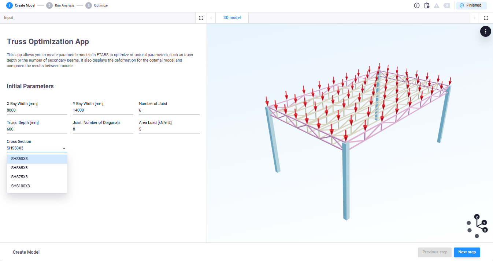

# ETABS Truss Parameterization App

This template app demonstrates how to create a structure in ETABS with multiple trusses, adjusting parameters like the number of diagonals, bay width/length, truss depth, and column height. An area load is applied to the top beam nodes, which can also be modified.

The app includes two optimization features: one to optimize either the number of joists/secondary beams or the truss depth.

## First Step
In the first step, users set initial parameters.

## Second Step
The second step offers two views: a 3D Geometry view displaying the deformed shape of the model.

### Third Step
In this step, users can define the optimization parameters such as minimum and maximum joist numbers, minimum and maximum truss depth (Δh), and allowable displacement. A table presents the deformation values, along with a plot showing possible combinations. Models that meet the criteria are marked with green dots, while those that do not are marked in red.

